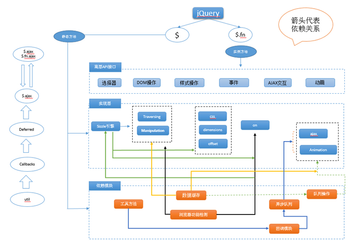

## jQuery 源码阅读


## 一、整体架构

jQuery 的模块依赖关系




```js
(function( window, undefined ) {
    // 构造 jQuery 对象
    var jQuery = (function() {
    var jQuery = function( selector, context ) {
        return new jQuery.fn.init( selector, context, rootjQuery ); }
    return jQuery;
})();
    // 工具方法 Utilities
    // 回调函数列表 Callbacks Object
    // 异步队列 Deferred Object
    // 浏览器功能测试 Support
    // 数据缓存 Data
    // 队列 Queue
    // 属性操作 Attributes
    // 事件系统 Events
    // 选择器 Sizzle
    //DOM 遍历 Traversing
    //DOM 操作 Manipulation
    // 样式操作 CSS(计算样式、内联样式)
    // 异步请求 Ajax
    // 动画 Effects
    // 坐标 Offset、尺寸 Dimensions window.jQuery = window.$ = jQuery;
})(window);
```

### 1.1 为什么用自调用匿名函数？

可以看到，这里的 jQuery 的内部实现全部被包裹在了 **函数作用域** 中，

**防止污染全局变量，同时保护私有变量**

### 1.2 为什么需要传入 `undefined` ？

这里涉及到一个非常重要的问题，`undefined` 的值是可以改变的！

```
undefined = "now it's defined";
alert( undefined );
```

测试的结果


## 参考资料

《jQuery技术内幕》
