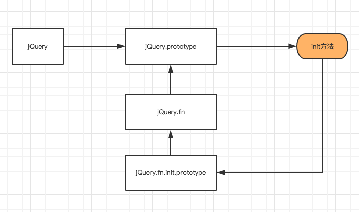

## jQuery 源码阅读


## 一、整体架构

jQuery 的模块依赖关系


```js
(function( window, undefined ) {
    // 构造 jQuery 对象
    var jQuery = (function() {
    var jQuery = function( selector, context ) {
        return new jQuery.fn.init( selector, context, rootjQuery ); }
    return jQuery;
})();
    // 工具方法 Utilities
    // 回调函数列表 Callbacks Object
    // 异步队列 Deferred Object
    // 浏览器功能测试 Support
    // 数据缓存 Data
    // 队列 Queue
    // 属性操作 Attributes
    // 事件系统 Events
    // 选择器 Sizzle
    //DOM 遍历 Traversing
    //DOM 操作 Manipulation
    // 样式操作 CSS(计算样式、内联样式)
    // 异步请求 Ajax
    // 动画 Effects
    // 坐标 Offset、尺寸 Dimensions window.jQuery = window.$ = jQuery;
})(window);
```

### 1.1 为什么用闭包？

可以看到，这里的 jQuery 的内部实现全部被包裹在了 **函数作用域** 中，

**防止污染全局变量，同时保护私有变量**

### 1.2 为什么需要传入 `undefined` ？

这里涉及到一个非常重要的问题，`undefined` 的值是可以改变的！

```
undefined = "now it's defined";
alert( undefined );
```

测试的结果


其实传入 `window` 和 `undefined` 的另一个好处是，可以进一步压缩

## 二、构造 jQuery 对象

### 无 New 构造

```js
// 无 new 构造
$('#test').text('Test');

// 当然也可以使用 new
var test = new $('#test');
test.text('Test');
```

显然，我们在调用 jQuery 的时候，从来都没有去 `new` 一个对象吧？那是怎么实现实例化的呢？

```js
(function(window, undefined) {
    var
    jQuery = function(selector, context) {

        // The jQuery object is actually just the init constructor 'enhanced'
        // 看这里，实例化方法 jQuery() 实际上是调用了其拓展的原型方法 jQuery.fn.init
        return new jQuery.fn.init(selector, context, rootjQuery);
    },

    // jQuery.prototype 即是 jQuery 的原型，挂载在上面的方法，即可让所有生成的 jQuery 对象使用
    jQuery.fn = jQuery.prototype = {
        // 实例化化方法，这个方法可以称作 jQuery 对象构造器
        init: function(selector, context, rootjQuery) {
            // ...
        }
    }
    // 这一句很关键，也很绕
    // jQuery 没有使用 new 运算符将 jQuery 实例化，而是直接调用其函数
    // 要实现这样,那么 jQuery 就要看成一个类，且返回一个正确的实例
    // 且实例还要能正确访问 jQuery 类原型上的属性与方法
    // jQuery 的方式是通过原型传递解决问题，把 jQuery 的原型传递给jQuery.prototype.init.prototype
    // 所以通过这个方法生成的实例 this 所指向的仍然是 jQuery.fn，所以能正确访问 jQuery 类原型上的属性与方法
    jQuery.fn.init.prototype = jQuery.fn;

})(window)
```

### 真正的初始化方法：init

可以看出

1、真正的 jQuery 实例是在 `init` 方法中产生的

2、无论是通过 `init` 还是通过 new 一个 `jQuery` 实例，他们的原型都是 `jQuery.prototype`


原型之间的关系如下



## 参考资料

《jQuery技术内幕》
